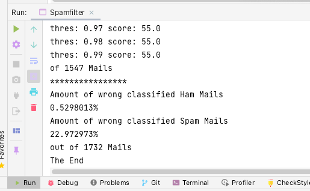

# SpamFilter
## By Michelle Wächter & Tobias Vonesch
1. Sie verschaffen sich einen U ̈berblick u ̈ber die Funktionsweise, etwa via (a) http://www.math.kit.edu/ianm4/~ritterbusch/seite/spam/de
   (b) https://en.wikipedia.org/wiki/Naive_Bayes_spam_filtering.
   
2. Sie erstellen ein Java-Programm, was folgendes leistet:
   * (a) Die Emails aus ham-anlern.zip bzw. spam-anlern.zip werden nacheinander eingelesen
   und als Ham bzw. Spam markiert. Dabei wird fu ̈r jedes Wort in einer Ham- bzw. Spam-Mail geza ̈hlt, in wie vielen Ham- bzw. Spam-Mails das Wort vorkommt. Ein Wort muss dabei kein sinnvolles Wort sein. Sie ko ̈nnen also jeweils die gesamte Mail, inklusive Header, einlesen und ein Leerzeichen als Worttrennungssymbol verwenden.
   * (b) Sie implementieren eine Funktion, die fu ̈r eine gegebene Mail die Spamwahrscheinlich- keit gema ̈ss der in der obigen Quelle hergeleiteten Formel berechnet. (Dabei ko ̈nnen Sie alle Wo ̈rter (und nicht nur die signifikantesten Wo ̈rter) zur Berechnung hinzu- ziehen.)
   Falls ein Wort, etwa money in der Anlernphase nur in Ham-Mails vorkam, dann hat ei- ne Mail, die das Wort money entha ̈lt, eine Spamwahrscheinlichkeit von 0 (Begru ̈nden Siedies!),selbstdann,wenndieMailauchViagra, enlargement, Kenia, win,... entha ̈lt. Dies ist natu ̈rlich unerwu ̈nscht. Fu ̈gen Sie deshalb in der Anlernphase jedes Wort, was in einer der Ham-Mails aber in keiner Spam-Mail vorkommt, mit einer “Anzahl” α (sehr klein (< 1)) in den Spam-Korpus ein und umgekehrt fu ̈r jedes Wort, welches in einer Spam- aber keine Ham-Mail vorkommt.
   * (c) Bestimmen Sie geeignete Werte fu ̈r den Schwellenwert, wann eine Mail als Spam klassifiziert werden soll und fu ̈r obiges α, so dass ihr Spamfilter gut arbeitet. Nutzen Sie dazu die Mails in ham-kalibrierung.zip und spam-kalibrierung.zip.
   * (d) Geben Sie an, wie viel Prozent der Mails in ham-test.zip bzw. spam-test.zip korrekt klassifiziert wurden.
   
3. Erwartet wird eine Abgabe, bei der nach dem Ausfu ̈hren des Programms eine Zusammen- fassung aller Werte (Schwellenwert, α, Erkennungsraten) angezeigt wird.

## Result
